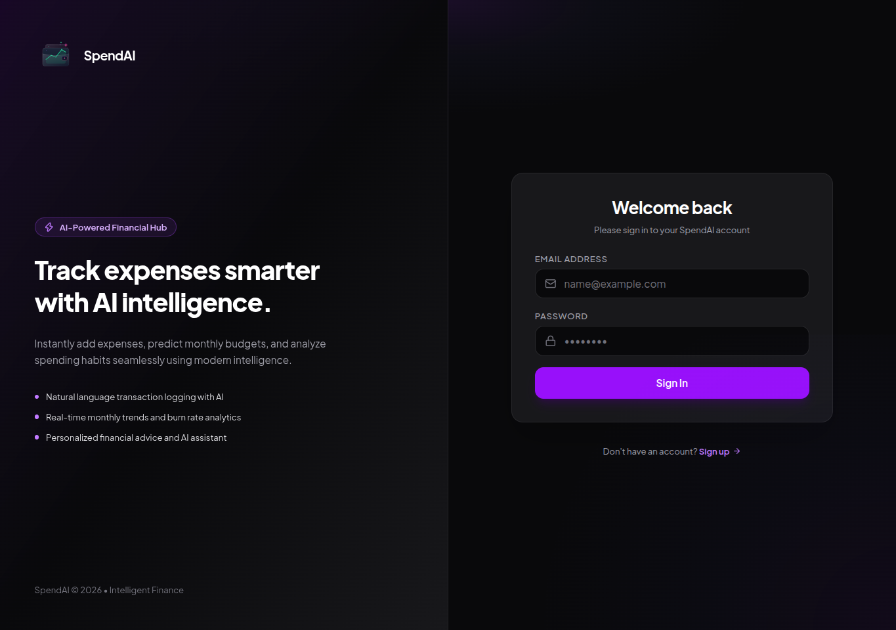
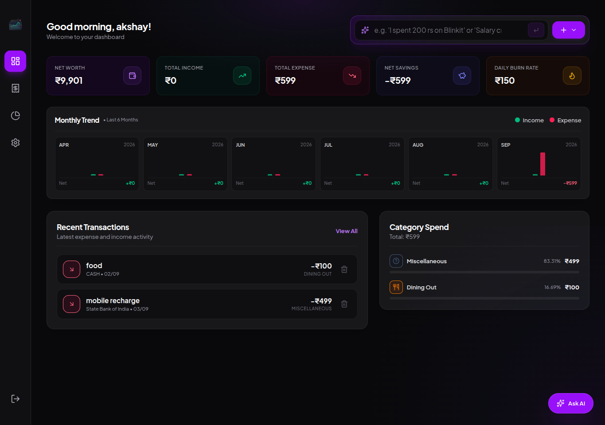

# SpendAI - Expense Tracker

An intelligent expense tracking and personal finance application built with Next.js, React, and Tailwind CSS. Log expenses using natural language, analyze monthly spending trends, and interact with an AI financial assistant.

---

## 📺 YouTube Playlist
Watch the full project build and walkthrough here:  
👉 **[Watch the YouTube Playlist](https://www.youtube.com/playlist?list=PLtpw--JmgzO0RK9PfzPV3rOMi3Qnac9Ks)**

---

## 📸 Screenshots

| Landing Page | Dashboard Page |
| :---: | :---: |
|  |  |

---

## ✨ Features

- **Natural Language Logging**: Add transactions effortlessly by typing natural sentences (e.g., *"I spent 200 rs on Blinkit"*).
- **Real-Time Dashboard**: Immediate balance, spend trends, and category distribution updates.
- **AI Financial Assistant**: Interactive chat widget for answering spending queries, daily burn rates, and financial advice.
- **Account & Card Management**: Track bank accounts, debit/credit cards, and cash balances independently.
- **Responsive Design**: Modern dark theme with desktop sidebar and mobile navigation drawer.

---

## 🛠️ Tech Stack

- **Framework**: [Next.js](https://nextjs.org/) (App Router)
- **Library**: React 19
- **Language**: TypeScript
- **Styling**: Tailwind CSS
- **State Management**: Zustand
- **Forms & Validation**: React Hook Form, Zod
- **Icons**: Lucide React

---

## 🚀 Getting Started

### 1. Clone the repository and install dependencies

```bash
npm install
```

### 2. Configure Environment Variables

Create a `.env.local` file in the root directory:

```env
NEXT_PUBLIC_API_URL=http://localhost:8080/api
```

### 3. Run Development Server

```bash
npm run dev
```

Open [http://localhost:3000](http://localhost:3000) in your browser.
